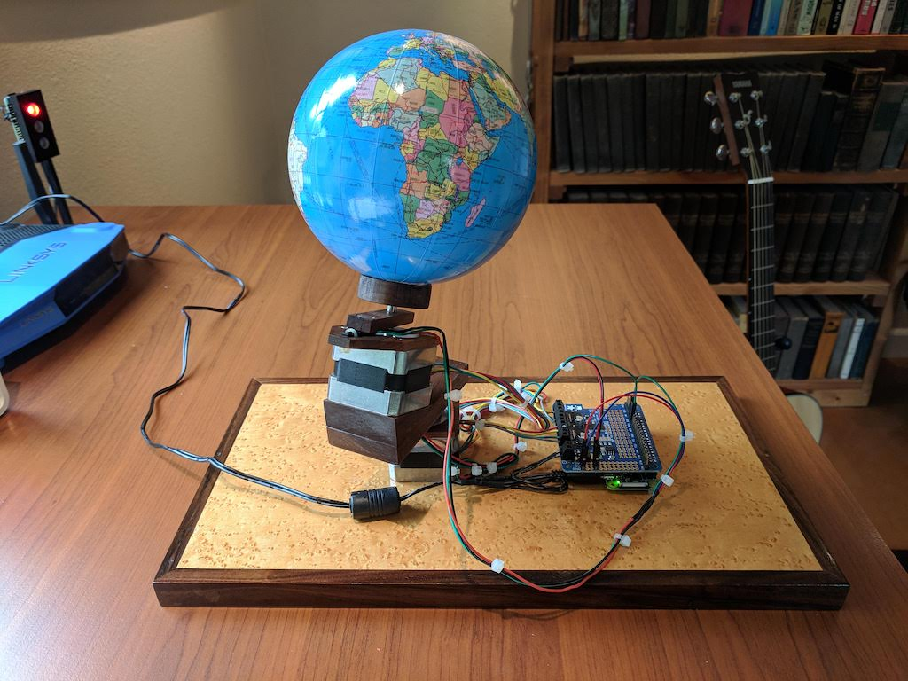
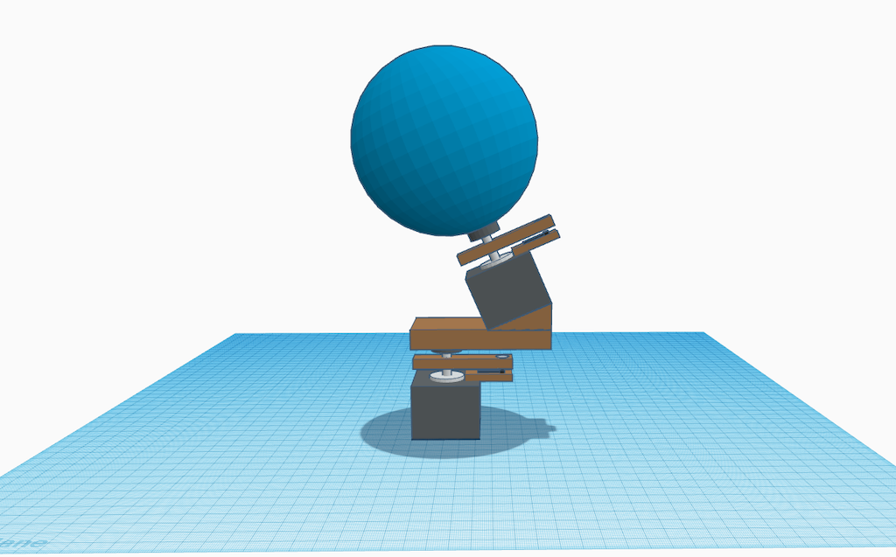

## Overview

Earth Model is a Raspberry Pi Python project for displaying earth in its orbit and rotation in a physical model
using steppers motors, hall effect sensors, and magnets.

## Dependencies

Earth Model has the following dependencies.

* [`skyfield`](https://rhodesmill.org/skyfield/) - library for calculating astronomical predictions
* [`adafruit_motorkit`](https://github.com/adafruit/Adafruit_CircuitPython_MotorKit) - library for controlling stepper motors
* [`RPi.GPIO`](https://pypi.org/project/RPi.GPIO) - library for interacting with Raspberry Pi GPIO pins

## Requirements

The following physical component are required:

* Raspberry Pi
* Stepper motor (x2) NEMA-17 size, 200 step/rev, 12V 350MA [Adafruit](https://www.adafruit.com/product/324)
* Stepper motor HAT for Raspberry Pi [Adafruit](https://www.adafruit.com/product/2348) 
* Hall effect sensor (x2) [Amazon](https://www.amazon.com/gp/product/B01M2WASFL/ref=ppx_yo_dt_b_asin_title_o04_s01?ie=UTF8&psc=1)
* Tiny magnets (x2)

## Details

When `earth_model.py` is launched, it moves the physical earth model to its orbit and rotation 
reference position: winter solstice in the northern hemisphere with the prime meridian directly facing the sun.
The application then moves the physical earth model to its location at the current clock time and
continues moving the earth model indefinitely.   

## Service

Install the app as a service using the steps in the raspberrypi.org systemd [reference document](https://www.raspberrypi.org/documentation/linux/usage/systemd.md).
The `earth_model.sh` and `earth_model.service` files are included as a convenience.

```bash
# copy service configuration
sudo cp earth_model.service /etc/systemd/system/
...
# start earth model service 
sudo systemctl start earth_model.service
...
# enable earth model service
sudo systemctl enable earth_model.service
```

## Example


